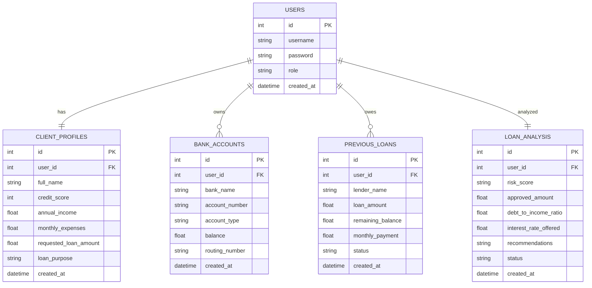

# Finewise AI - Complete Implementation Plan (Backend & Frontend)

This plan details the design and implementation of both the backend and frontend for **Finewise AI**. The system uses a single, highly accurate, mathematical decision algorithm: the **Multi-Factor Creditworthiness Index (MF-CWI) Algorithm**. The application consists of a Node.js/SQLite backend and a modern HTML/CSS/JS frontend served directly by the Express server.

---

## User Review Required

> [!IMPORTANT]
> **Data Privacy Enforcement**
> Admins will be able to see the results of the deep analysis (approved loan amount, risk level, debt-to-income ratio, interest rate, credit score, income, expenses) and the loan amount requested by the client. However, raw bank details (e.g., Bank Name, Account Number, Routing Number, and Balance) will be strictly hidden from the Admin dashboard APIs and views to protect client privacy. 

> [!NOTE]
> **Single Advanced Algorithm**
> We will implement the **Multi-Factor Creditworthiness Index (MF-CWI) Algorithm** to evaluate clients. This algorithm aggregates credit scores, debt-to-income (DTI) ratio, expenses, cash reserves, and historical loans using normalized weighted values to compute a unified creditworthiness index. This index is then used to determine the risk tier, interest rates, and loan approvals.

---

## Proposed Changes

We will create a directory named `finewise-ai` inside the workspace `e:\smart bridge` containing the complete codebase.

### 1. Database Schema

We will use SQLite (`sqlite3`) for storing user data, financial profiles, bank accounts, existing loans, and analysis results.

---

### 2. The Core Algorithm: Multi-Factor Creditworthiness Index (MF-CWI)

We will use a single, highly accurate, multi-factor weighting algorithm to calculate credit risk, interest rate, and maximum approved loan amount.

#### Step A: Normalization of Inputs (values mapped from 0 to 1)
1. **Credit Score Rating ($S_{credit}$)**:
   $$S_{credit} = \frac{\text{Credit Score} - 300}{850 - 300}$$
2. **Debt-to-Income (DTI) Score ($S_{DTI}$)**:
   * First calculate DTI:
     $$\text{DTI} = \frac{\text{Monthly Expenses} + \text{Sum of Active Loan Monthly Payments}}{\text{Annual Income} / 12}$$
   * Map to score (lower DTI yields higher score):
     $$S_{DTI} = 1 - \min(1, \frac{\text{DTI}}{0.60})$$
3. **Expense-to-Income Score ($S_{exp}$)**:
   $$S_{exp} = 1 - \min(1, \frac{\text{Monthly Expenses}}{\text{Annual Income} / 12})$$
4. **Reserves Score ($S_{res}$)**:
   * Measures liquid cash in bank accounts compared to monthly expenses:
     $$S_{res} = \min(1, \frac{\text{Total Bank Account Balances}}{\text{Monthly Expenses} \times 3})$$
5. **Loan Payment History Score ($S_{history}$)**:
   * Measures active debt burden:
     $$S_{history} = \begin{cases} 
      1.0 & \text{if no previous loans} \\
      \max\left(0, 1 - \frac{\text{Remaining Loan Balance}}{\text{Original Loan Amount}}\right) & \text{if previous loans exist}
     \end{cases}$$

#### Step B: Weighted Creditworthiness Index (CWI) Calculation
The algorithm computes a unified Creditworthiness Index ($CWI$):
$$\text{CWI} = 0.40 \cdot S_{credit} + 0.25 \cdot S_{DTI} + 0.15 \cdot S_{exp} + 0.10 \cdot S_{res} + 0.10 \cdot S_{history}$$

#### Step C: Risk Tiering
* **Low Risk**: $\text{CWI} \ge 0.75$
* **Medium Risk**: $0.50 \le \text{CWI} < 0.75$
* **High Risk**: $\text{CWI} < 0.50$

#### Step D: Risk-Adjusted Interest Rate (ROI)
$$\text{ROI} = \text{Base Rate} + (1 - \text{CWI}) \times \text{Risk Premium}$$
* $\text{Base Rate} = 4.5\%$
* $\text{Risk Premium} = 15\%$

#### Step E: Approved Loan Amount Calculation
* Maximum monthly loan payment capacity:
  $$\text{Max Monthly Payment} = \left(\text{Monthly Income} \times (0.45 \cdot \text{CWI})\right) - \text{Existing Debt Payments}$$
* If $\text{Max Monthly Payment} \le 0$, the approved loan amount is $\$0$ (High risk/insufficient cash flow).
* Otherwise, using an amortization formula for a $60$-month term at the risk-adjusted rate ($r = \text{ROI} / 12$, $n = 60$):
  $$\text{Approved Loan Amount} = \text{Max Monthly Payment} \times \frac{1 - (1 + r)^{-n}}{r}$$
  * *The final approved loan amount is capped at $3\times$ annual income or $\$250,000$ (whichever is lower).*

---

### 3. Frontend Architecture & Design

The frontend will be served statically by Express (`/public` directory) using modern, elegant vanilla HTML5, CSS3, and JavaScript:
* **Theme**: Modern Dark Mode with Glassmorphism elements, custom colors (Deep purple, emerald green, and dark sapphire slate), responsive grids, and subtle fade-in animations.
* **Libraries**: **Chart.js** via CDN to render interactive visual graphs of:
  * Debt-to-income distribution.
  * Cash reserves vs expenses.
  * User Creditworthiness Index gauge.
* **Authentication**: Intercepts requests, stores JWT inside `localStorage`, handles logins, and redirects users based on their roles.

#### Page Structure (`public/` directory):
* `index.html` - Landing page with animations, introducing Finewise AI.
* `login.html` - Integrated Login/Register page supporting both Client and Admin entry.
* `client.html` - Dashboard for clients containing forms to submit financial profiles, view their CWI analysis, add bank details, list previous loans, and review bank suggestions.
* `admin.html` - Dashboard for admins containing aggregated charts and a client directory showing analysis summaries (bank credentials/details are strictly hidden).

---

### 4. File Structure

We will create the following files in the project directory:

#### [NEW] [package.json](file:///e:/smart bridge/finewise-ai/package.json)
Configures Node.js project, scripts, and dependencies.

#### [NEW] [database.js](file:///e:/smart bridge/finewise-ai/database.js)
Initializes the SQLite database and executes database migration commands.

#### [NEW] [middleware/auth.js](file:///e:/smart bridge/finewise-ai/middleware/auth.js)
Provides token validation and role-based route guards.

#### [NEW] [services/analysis.js](file:///e:/smart bridge/finewise-ai/services/analysis.js)
Implements the mathematical **Multi-Factor Creditworthiness Index (MF-CWI) Algorithm**.

#### [NEW] [routes/auth.js](file:///e:/smart bridge/finewise-ai/routes/auth.js)
Defines register/login endpoints.

#### [NEW] [routes/client.js](file:///e:/smart bridge/finewise-ai/routes/client.js)
Defines client profile, bank, and loan endpoints.

#### [NEW] [routes/admin.js](file:///e:/smart bridge/finewise-ai/routes/admin.js)
Defines admin analytics endpoints with privacy controls.

#### [NEW] [server.js](file:///e:/smart bridge/finewise-ai/server.js)
Main application bootstrap file serving endpoints and frontend static files.

#### [NEW] [public/index.html](file:///e:/smart bridge/finewise-ai/public/index.html)
Landing page.

#### [NEW] [public/login.html](file:///e:/smart bridge/finewise-ai/public/login.html)
Unified login/register interface.

#### [NEW] [public/client.html](file:///e:/smart bridge/finewise-ai/public/client.html)
Client portal with forms, gauge charts, and loan analyzer.

#### [NEW] [public/admin.html](file:///e:/smart bridge/finewise-ai/public/admin.html)
Admin dashboard with client list and analysis viewer.

---

## Verification Plan

### Automated / Semi-Automated Verification
1. We will launch the application server on port `3000` via `node server.js`.
2. We will run a script `test_backend.js` to assert API behaviors, registration, role checks, and database states.

### Manual Verification
1. Open `http://localhost:3000` in the browser.
2. Sign up and log in as a Client:
   * Put in income, expenses, and a credit score.
   * Add a bank account and a previous loan.
   * Run the analysis and verify that interest rates, risk tiers, and approved amounts render accurately.
3. Sign up and log in as an Admin:
   * View the client directory.
   * Verify that the client's creditworthiness details are visible, but the individual bank account numbers, balances, and sensitive routing fields are omitted.
